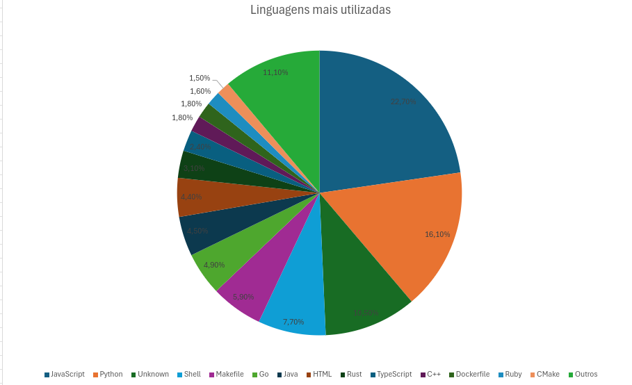

# Relatório laboratório 1 (preliminar)

## Objetivos do relatório

O objetivo deste laboratório é estudar as principais características de sistemas open-source populares, focando em
métricas que podem revelar aspectos importantes sobre o desenvolvimento desses projetos. Especificamente, buscamos
analisar:

- RQ 01: Verificar se sistemas populares são maduros/antigos, analisando a idade dos repositórios.
- RQ 02: Examinar se sistemas populares recebem muita contribuição externa, medindo o total de pull requests aceitas.
- RQ 03: Analisar a frequência de lançamentos de releases em sistemas populares, calculando o total de releases.
- RQ 04: Avaliar a frequência de atualizações em sistemas populares, verificando o tempo desde a última atualização.
- RQ 05: Identificar se os sistemas populares são escritos nas linguagens mais populares, analisando a linguagem primária
- de cada repositório.
- RQ 06: Estudar o percentual de issues fechadas nos sistemas populares, calculando a razão entre o número de issues
fechadas e o total de issues.
- RQ 07: Investigar se sistemas escritos nas linguagens mais populares recebem mais contribuição externa, lançam mais
releases e são atualizados com mais frequência.

## Metodologia

A metodologia adotada para responder às questões de pesquisa será baseada na coleta de dados dos 1.000 repositórios mais
populares do GitHub, utilizando a API GraphQL do GitHub. O processo será dividido em duas etapas:

1. Coleta de Dados

A coleta de dados será realizada por uma consulta GraphQL personalizada para obter informações sobre os 1.000
repositórios mais populares no GitHub. Para isso, será necessário:

Consulta GraphQL: Desenvolver uma consulta para buscar informações sobre o nome do repositório, número de estrelas,
proprietário, datas de criação e atualização, linguagem principal, quantidade de pull requests abertos e mesclados,
número de releases e issues abertas e fechadas.
Paginação: Para coletar dados de todos os 1.000 repositórios, implementaremos a funcionalidade de paginação na consulta
GraphQL, garantindo que a API do GitHub seja consultada de maneira eficiente, sem sobrecarregar o sistema.
Armazenamento em CSV: Os dados serão armazenados num arquivo .csv para facilitar a análise posterior.

2. Análise dos Dados

Após a coleta dos dados, será realizada a análise para responder às questões de pesquisa:

Análise Quantitativa: Será calculado o valor médio ou mediano das métricas para cada questão de pesquisa (RQ), como
idade do repositório, número de pull requests, total de releases, e outros. Essas métricas serão comparadas entre
diferentes repositórios e linguagens.
Análise Qualitativa: Para as métricas de categoria, como a linguagem primária dos repositórios, será realizada uma
contagem para identificar quais linguagens são mais comuns entre os repositórios populares.

## Resultados obtidos

*RQ-01: Sistemas populares são maduros/antigos?*

A idade média dos repositórios analisados foi de 8,6 anos, o que indica que, de fato, os repositórios mais populares
são, em sua maioria, maduros e têm uma longa trajetória de desenvolvimento.

---

*RQ-02: Sistemas populares recebem muita contribuição externa?*

Preliminarmente, a análise sugere que quanto maior o repositório, mais contribuições externas ele tende a receber. No
entanto, estamos realizando uma análise mais profunda, que considera outliers e será apresentada no relatório final.
Essa análise adicional pode confirmar ou revisar essa tendência observada até o momento.

---

*RQ-03: Sistemas populares lançam releases com frequência?*

A análise preliminar mostra que repositórios mais populares tendem a lançar menos releases. Contudo, da mesma forma que
na análise anterior, estamos considerando outliers e essa análise será aprofundada no relatório final, o que poderá
confirmar ou revisar esse entendimento.

---

*RQ-04: Sistemas populares são atualizados com frequência?*

Não foram observadas diferenças significativas entre os repositórios no que diz respeito à frequência de atualizações. A
pesquisa foi realizada no dia 20 de fevereiro, e 993 dos 1.000 repositórios buscados haviam sido atualizados nesse mesmo
dia. Apenas 7 repositórios tinham sido atualizados no dia anterior, o que sugere uma frequência bastante alta de
atualizações.

---

*RQ-05: Sistemas populares são escritos nas linguagens mais populares?*

As linguagens mais populares, de acordo com o Octaverse, são JavaScript, Python, Java, TypeScript e C#. Com exceção do
C#, todas as outras linguagens estão entre as mais utilizadas nos repositórios analisados, o que indica que a maioria
dos repositórios populares está escrita nas linguagens mais comuns no ecossistema de desenvolvimento.

---

*RQ-06: Sistemas populares possuem um alto percentual de issues fechadas?*

Preliminarmente, parece que os repositórios mais populares têm um percentual maior de issues fechadas. Esta análise
também está sendo complementada com a verificação de outliers, que será apresentada no relatório final. Isso pode
confirmar ou alterar o entendimento preliminar obtido até agora.

---

*RQ-07: Sistemas escritos em linguagens mais populares recebem mais contribuição externa, lançam mais releases e são
atualizados com mais frequência?*

Essa análise será realizada no relatório final, considerando os resultados das análises anteriores, especialmente no que
diz respeito à linguagem dos repositórios. A partir disso, poderemos entender se existe uma correlação entre as
linguagens mais populares e as características de contribuição externa, lançamento de releases e frequência de
atualizações.
