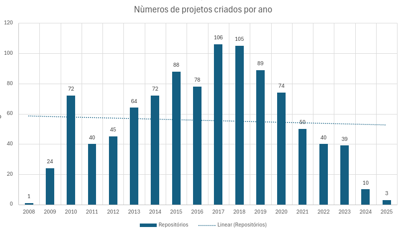

# Relatório laboratório 1

## Objetivos do relatório

O objetivo deste laboratório é estudar as principais características de sistemas open-source populares, focando em
métricas que podem revelar aspectos importantes sobre o desenvolvimento desses projetos. Especificamente, buscamos
analisar:

- RQ 01: Verificar se sistemas populares são maduros/antigos, analisando a idade dos repositórios.
- RQ 02: Examinar se sistemas populares recebem muita contribuição externa, medindo o total de pull requests aceitas.
- RQ 03: Analisar a frequência de lançamentos de releases em sistemas populares, calculando o total de releases.
- RQ 04: Avaliar a frequência de atualizações em sistemas populares, verificando o tempo desde a última atualização.
- RQ 05: Identificar se os sistemas populares são escritos nas linguagens mais populares, analisando a linguagem
  primária
- de cada repositório.
- RQ 06: Estudar o percentual de issues fechadas nos sistemas populares, calculando a razão entre o número de issues
  fechadas e o total de issues.
- RQ 07: Investigar se sistemas escritos nas linguagens mais populares recebem mais contribuição externa, lançam mais
  releases e são atualizados com mais frequência.

## Metodologia

A metodologia adotada para responder às questões de pesquisa será baseada na coleta de dados dos 1.000 repositórios mais
populares do GitHub, utilizando a API GraphQL do GitHub. O processo será dividido em duas etapas:

1. Coleta de Dados

A coleta de dados será realizada por uma consulta GraphQL personalizada para obter informações sobre os 1.000
repositórios mais populares no GitHub. Para isso, será necessário:

- Consulta GraphQL: Desenvolver uma consulta para buscar informações sobre o nome do repositório, número de estrelas,
  proprietário, datas de criação e atualização, linguagem principal, quantidade de pull requests abertos e mesclados,
  número de releases e issues abertas e fechadas.
- Paginação: Para coletar dados de todos os 1.000 repositórios, implementaremos a funcionalidade de paginação na
  consulta
  GraphQL.
- Armazenamento em CSV: Os dados serão armazenados num arquivo .csv para facilitar a análise posterior.

2. Análise dos Dados

Após a coleta dos dados, será realizada a análise para responder às questões de pesquisa:

- Análise Quantitativa: Será calculado o valor médio ou mediano das métricas para cada questão de pesquisa (RQ), como
  idade do repositório, número de pull requests, total de releases, e outros. Essas métricas serão comparadas entre
  diferentes repositórios e linguagens.
- Análise Qualitativa: Para as métricas de categoria, como a linguagem primária dos repositórios, será realizada uma
  contagem para identificar quais linguagens são mais comuns entre os repositórios populares.

## Resultados obtidos

*RQ-01: Sistemas populares são maduros/antigos?*

Com base nos dados obtidos, analisamos a data de criação de cada repositório para quantificar quantos foram criados a
cada ano desde 2008, ano de fundação do GitHub. A partir dessa análise, calculamos a média ponderada da idade dos
repositórios, utilizando a fórmula:
`(quantidade de repositórios no ano x idade do repositório) / quantidade total de repositórios`. Como resultado,
verificamos que a idade média dos repositórios é de 8,6 anos, o que indica que, de fato, os repositórios mais populares
são, em sua maioria, maduros e possuem uma longa trajetória de desenvolvimento.

---

*RQ-02: Sistemas populares recebem muita contribuição externa?*

Para avaliar se sistemas populares recebem mais contribuições externas, analisamos a quantidade total de pull requests (
PRs) aceitos nos repositórios. Em nossa análise inicial, observamos que o número de contribuições aumentava gradualmente
à medida que o repositório crescia.

Em um estudo posterior, identificamos a presença de vários outliers em nossa
amostra (valores que distorciam ou tendenciavam os resultados). Com isso, decidimos realizar uma nova análise, excluindo
os outliers (repositórios com números de PRs aceitos significativamente acima ou abaixo da média). Na segunda análise,
os dados corroboraram as conclusões da primeira: o número de contribuições aumentava conforme o repositório crescia,
porém de forma menos acentuada. Isso sugere que, ao remover os outliers, a popularidade do repositório exerce menor
influência no número de contribuições externas do que inicialmente parecia.

---

*RQ-03: Sistemas populares lançam releases com frequência?*

Em nossa análise inicial, observamos que o número de releases não aumentava necessariamente de acordo com a popularidade
do repositório, mantendo-se relativamente estável à medida que a popularidade crescia.

No entanto, ao removermos os
valores que poderiam distorcer a análise (outliers), constatamos que o número de releases, na verdade, diminuía à medida
que a popularidade dos repositórios aumentava. Foi mais comum encontrar projetos sem releases entre os mais populares do
que entre os menos populares. É importante destacar, contudo, que a quantidade de releases é medida com base nas
publicações de releases na ferramenta do GitHub. Ou seja, se um repositório não utiliza essa funcionalidade para lançar
suas releases, os dados não refletem a realidade do projeto nesta análise e por consequência distorce o resultado.

---

*RQ-04: Sistemas populares são atualizados com frequência?*

Não foram observadas diferenças significativas entre os repositórios no que diz respeito à frequência de atualizações. A
pesquisa foi realizada no dia 20 de fevereiro de 2025, e 993 dos 1.000 repositórios buscados haviam sido atualizados
nesse mesmo dia. Apenas 7 repositórios tinham sido atualizados no dia anterior (19 de fevereiro de 2025), o que sugere
uma frequência bastante alta de atualizações nos repositórios como um todo.

---

*RQ-05: Sistemas populares são escritos nas linguagens mais populares?*

As linguagens mais populares, de acordo com o Octaverse, são JavaScript, Python, Java, TypeScript e C#. Com exceção do
C#, todas as outras linguagens estão entre as mais utilizadas nos repositórios analisados, o que indica que a maioria
dos repositórios populares está escrita nas linguagens mais comuns no ecossistema de desenvolvimento.

---

*RQ-06: Sistemas populares possuem um alto percentual de issues fechadas?*

Preliminarmente, parece que os repositórios mais populares têm um percentual maior de issues fechadas. Esta análise
também está sendo complementada com a verificação de outliers, que será apresentada no relatório final. Isso pode
confirmar ou alterar o entendimento preliminar obtido até agora.

---

*RQ-07: Sistemas escritos em linguagens mais populares recebem mais contribuição externa, lançam mais releases e são
atualizados com mais frequência?*

Essa análise será realizada no relatório final, considerando os resultados das análises anteriores, especialmente no que
diz respeito à linguagem dos repositórios. A partir disso, poderemos entender se existe uma correlação entre as
linguagens mais populares e as características de contribuição externa, lançamento de releases e frequência de
atualizações.
