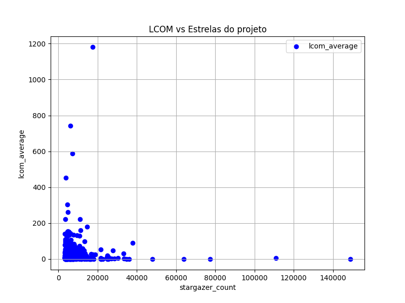
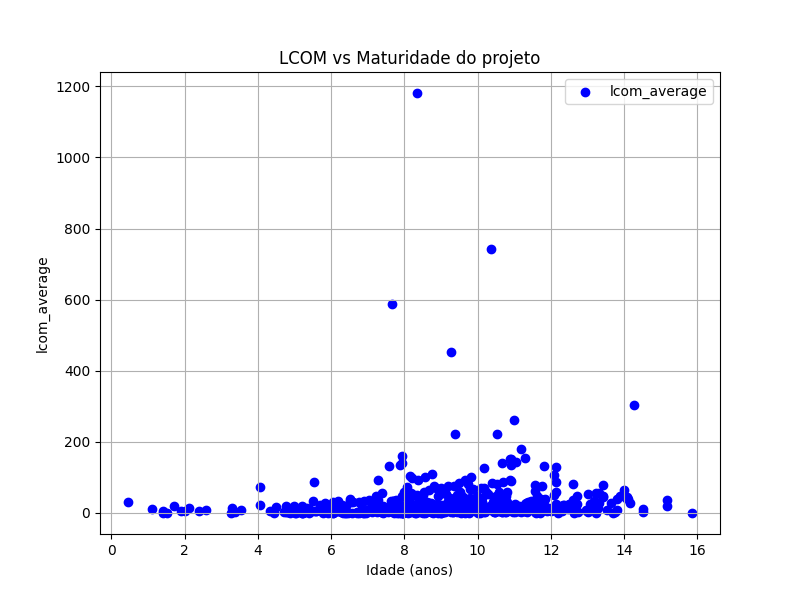

# Relatório Laboratório 2

## Objetivos do Relatório

O objetivo deste laboratório é analisar aspectos da qualidade de repositórios desenvolvidos na linguagem Java, correlacionando-os com
características do seu processo de desenvolvimento, sob a perspectiva de métricas de produto calculadas através da ferramenta CK. Buscamos
analisar:

- **RQ 01**: Relação entre a popularidade dos repositórios e as suas características de qualidade.
- **RQ 02**: Relação entre a maturidade do repositório e as suas características de qualidade.
- **RQ 03**: Relação entre a atividade dos repositórios e as suas características de qualidade.
- **RQ 04**: Relação entre o tamanho dos repositórios e as suas características de qualidade.

## Metodologia

A metodologia adotada para responder às questões de pesquisa será baseada na coleta de dados dos 1.000 repositórios mais populares do
GitHub, utilizando a API GraphQL do GitHub. O processo será dividido em duas etapas:

1. **Coleta de Dados**
    - Desenvolver uma consulta GraphQL para obter informações como nome do repositório, número de estrelas, datas de criação e atualização,
      quantidade de pull requests, releases e issues abertas/fechadas.
    - Implementar paginação para coletar os dados de todos os 1.000 repositórios.
    - Armazenar os dados em um arquivo .csv para análise posterior.

2. **Análise dos Dados**
    - **Análise Quantitativa**: Calcular médias, medianas e desvios padrões das métricas.
    - **Análise Qualitativa**: Identificar padrões nas características de qualidade dos repositórios.

## Resultados Obtidos

### **RQ-01: Qual a relação entre a popularidade dos repositórios e as suas características de qualidade?**

#### **Hipótese**

Repositórios mais populares tendem a apresentar melhores métricas de qualidade, pois geralmente possuem mais contribuidores ativos, revisão
de código mais rigorosa e maior manutenibilidade.

#### **Análise Final**

Analisando a relação entre CBO e a popularidade dos repositórios, podemos observar uma tendência de diminuição do acoplamento com
o aumento da popularidade do projeto. Isso pode ser explicado pelo fato de que projetos mais populares tendem a ser mais bem estruturados,
com uma arquitetura mais modular e componentes mais independentes. O gráfico abaixo ilustra essa relação:

Esse entendimento é observado também em outras métricas, como DIT e LCOM, que apresentam uma correlação negativa com a popularidade dos
projetos. Esses resultados corroboram a hipótese inicial de que repositórios mais populares tendem a ter melhores métricas de qualidade.

---

### **RQ-02: Qual a relação entre a maturidade do repositório e as suas características de qualidade?**

#### **Hipótese**

Repositórios mais antigos tendem a apresentar código mais modular e coeso, devido à evolução natural do software e refatoramentos ao longo
do tempo.

#### **Análise Final**

Em análise aos dados, observa-se que a correlação entre a maturidade de um projeto e suas métricas de qualidade (CBO, DIT e LCOM) é baixa,
indicando que a idade do repositório não é um fator determinante para a qualidade do código. Esse resultado vai contra a hipótese
inicialmente proposta, de que repositórios mais antigos teriam melhores métricas de qualidade.

Os gráficos a seguir ilustram a relação entre a idade do repositório e as métricas de CBO, DIT e LCOM, respectivamente:

### **RQ-03: Qual a relação entre a atividade dos repositórios e as suas características de qualidade?**

#### **Hipótese**

Repositórios com alta atividade (muitos commits, pull requests e releases) tendem a ter melhores métricas de qualidade, pois possuem revisão
contínua e colaboração ativa.

#### **Análise Final**

Com relação ao CBO, o aumento do número de releases não apresenta uma tendência clara de melhoria ou piora da métrica. Isso sugere que a
quantidade de releases não é um fator determinante para a qualidade do código em termos de acoplamento.

No que diz respeito ao DIT, é observada uma manutenção da métrica, sem grandes variações em relação ao número de releases.

Por fim, analisando a métrica LCOM, observa-se uma tendência de aumento da coesão com o aumento do número de releases.

Os resultados encontrados para essa análise confirmam parcialmente a hipótese inicial, indicando que a atividade do repositório pode
influenciar em suas métricas de qualidade, especialmente no que diz respeito à coesão do código, mas não representa um fator determinante
para as demais métricas.

---

### **RQ-04: Qual a relação entre o tamanho dos repositórios e as suas características de qualidade?**

#### **Hipótese**

Repositórios maiores podem apresentar maior acoplamento e menor coesão, devido à complexidade crescente.

#### **Análise Final**

Com relação às métrias de acoplamento (CBO e DIT), não se observa uma tendência clara de aumento ou diminuição com o tamanho do repositório.

No que tange à coesão (LCOM), observa-se uma tendência de aumento da coesão com o aumento do tamanho do repositório. Isso sugere que
repositórios maiores tendem a ter componentes mais coesos e independentes, o que pode ser explicado pela necessidade de modularização e
separação de responsabilidades em projetos de maior porte.

Essas análises corroboram parcialmente a hipótese inicial, indicando que o tamanho do repositório pode influenciar em suas métricas de
qualidade, especialmente no que diz respeito à coesão do código, mas não representa um fator determinante para as demais métricas.

---

## **Conclusão**

A análise dos dados coletados dos repositórios mais populares do GitHub revelou algumas tendências interessantes sobre a relação entre as
características de qualidade do código e fatores como popularidade, maturidade, atividade e tamanho dos repositórios. Repositórios mais
populares tendem a apresentar melhores métricas de qualidade, como menor acoplamento (CBO) e maior coesão (LCOM), corroborando a hipótese de
que projetos populares são mais bem estruturados e mantidos (RQ 01). No entanto, a idade do repositório não mostrou uma correlação
significativa com as métricas de qualidade, contrariando a hipótese de que repositórios mais antigos teriam código mais modular e coeso (RQ
02).

A atividade do repositório, medida pelo número de releases, mostrou uma correlação positiva com a coesão do código (LCOM), mas não
apresentou uma tendência clara em relação ao acoplamento (CBO) e profundidade da herança (DIT) (RQ 03). Repositórios maiores tendem a ter
componentes mais coesos, sugerindo que a modularização e separação de responsabilidades são mais evidentes em projetos de maior porte (RQ
04).

Esses resultados indicam que, embora alguns fatores como popularidade e tamanho possam influenciar positivamente certas métricas de
qualidade, outros fatores como maturidade e atividade não são determinantes para a qualidade do código. Portanto, a qualidade de um
repositório é multifacetada e depende de uma combinação de diversos fatores, incluindo outros pontos que não foram abordados neste
estudo.

