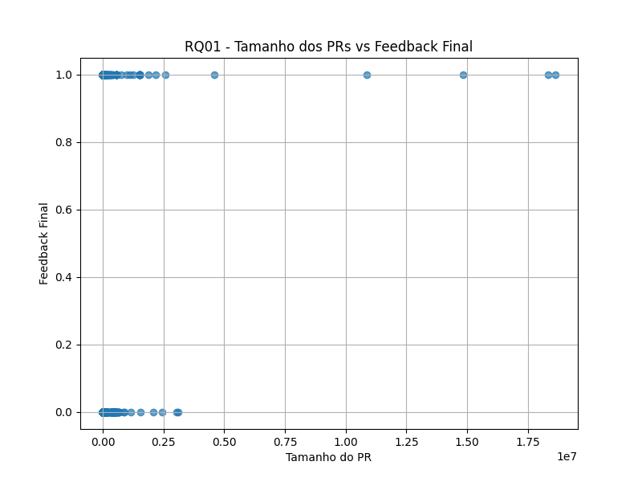
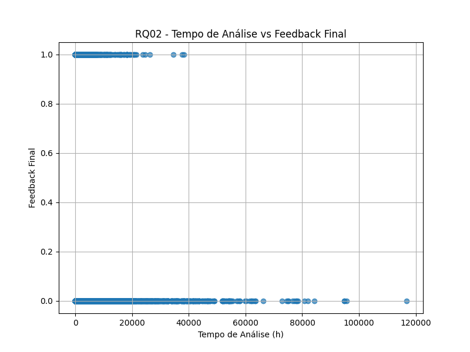
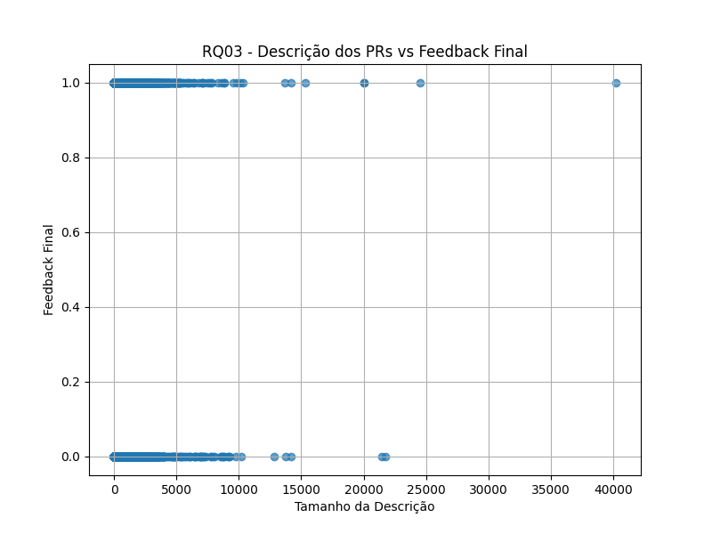
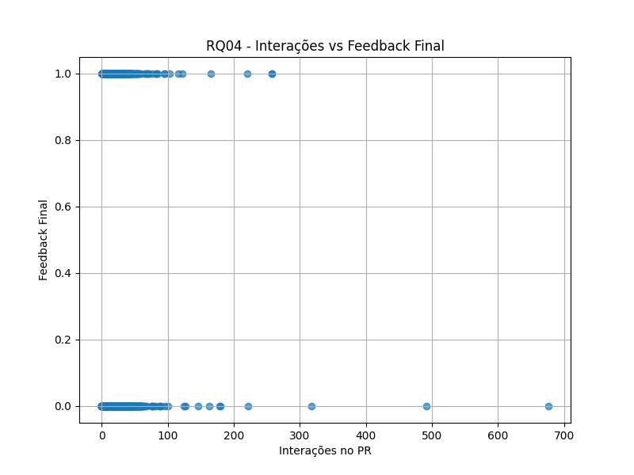
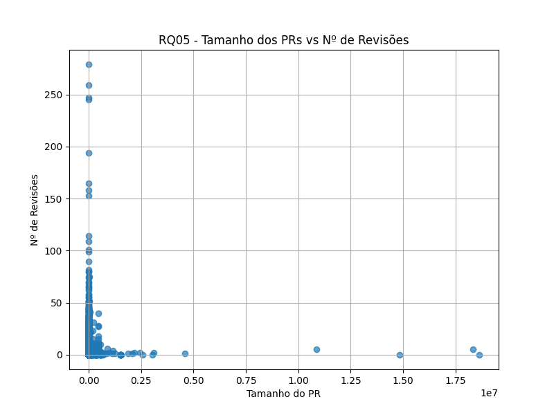
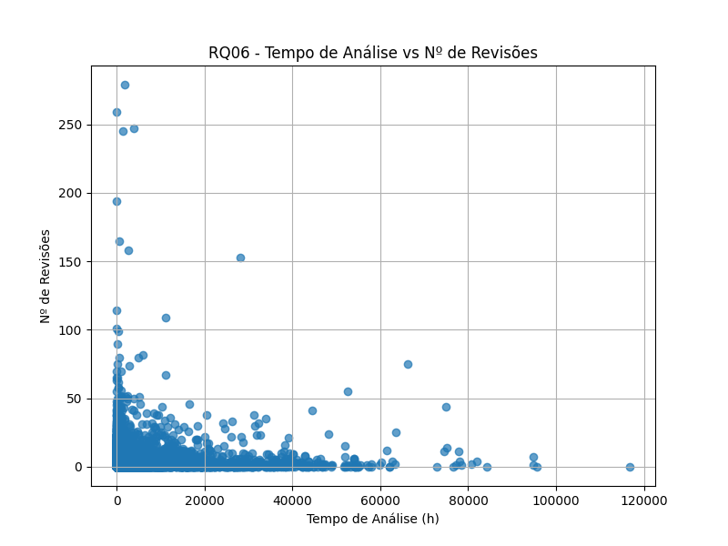
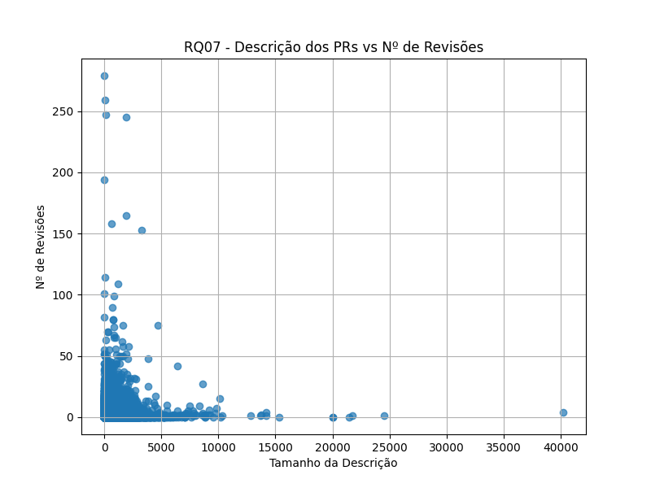
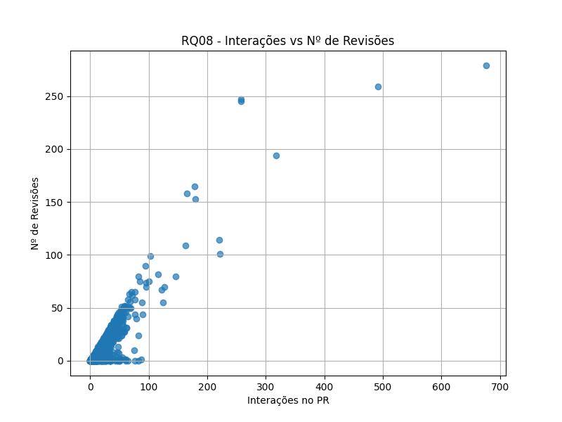

# Relatório Laboratório 3

## Objetivos do Relatório

O objetivo deste laboratório é compreender como diferentes características dos Pull Requests (PRs) influenciam o processo de revisão de código. Buscamos
analisar:

**A. Feedback Final das Revisões**

- **RQ 01**: Relação entre o tamanho dos PRs e o feedback final das revisões
- **RQ 02**: Relação entre o tempo de análise dos PRs e o feedback final das revisões
- **RQ 03**: Relação entre a descrição dos PRs e o feedback final das revisões
- **RQ 04**: Relação entre as interações nos PRs e o feedback final das revisões

**B. Número de Revisões**

- **RQ 05**: Relação entre o tamanho dos PRs e o número de revisões realizadas
- **RQ 06**: Relação entre o tempo de análise dos PRs e o número de revisões realizadas
- **RQ 07**: Relação entre a descrição dos PRs e o número de revisões realizadas
- **RQ 08**: Relação entre as interações nos PRs e o número de revisões realizadas

## Metodologia

A metodologia adotada para responder às questões de pesquisa será baseada na coleta de dados dos 1.000 repositórios mais populares do
GitHub, utilizando a API GraphQL do GitHub. O processo será dividido em duas etapas:

1. **Coleta de Dados**

2. **Análise dos Dados**

   A análise foi realizada com base em dados extraídos de PRs de diversos repositórios. Para cada PR, coletamos métricas específicas que foram utilizadas para responder às questões de pesquisa em arquivos CSV. A partir dos arquivos rodamos um script utilizando a biblioteca pandas para gerar gráficos.

   Para avaliar as relações entre as variáveis, foi utilizado o teste de correlação de Spearman. Esta escolha se justifica pelo fato de que as distribuições dos dados nem sempre seguem uma distribuição normal e, portanto, o teste de Spearman — que é não-paramétrico — é mais apropriado. Ele mede a força e a direção da associação monotônica entre duas variáveis.

   Além disso, todas as análises foram realizadas com base nos valores medianos dos PRs, conforme proposto, para garantir uma interpretação mais robusta e menos sensível a outliers.

## Resultados Obtidos

### **A. Feedback Final das Revisões (Status do PR)**

### **RQ01. Qual a relação entre o tamanho dos PRs e o feedback final das revisões?**

#### **Hipótese**

PRs maiores, com mais arquivos modificados e linhas alteradas, tendem a receber mais feedbacks negativos (como rejeição ou neces
sidade de mudanças), por apresentarem maior complexidade e risco.

#### **Análise Final**

---

### **RQ02. Qual a relação entre o tempo de análise dos PRs e o feedback final das revisões?**

#### **Hipótese**

PRs que demoram mais para serem analisados têm maior chance de receber feedbacks negativos, indicando que revisores encontraram dificuldades ou incertezas durante a análise.

#### **Análise Final**

---

### **RQ03. Qual a relação entre a descrição dos PRs e o feedback final das revisões?**

#### **Hipótese**

PRs com descrições mais detalhadas têm maior chance de serem aceitos, pois fornecem mais contexto e facilitam o trabalho dos revisores.

#### **Análise Final**

---

### **RQ04. Qual a relação entre as interações nos PRs e o feedback final das revisões?**

#### **Hipótese**

PRs com mais interações (comentários e participantes) tendem a receber feedbacks negativos ou pedidos de mudanças, sugerindo que houve mais debate ou discordância durante a revisão.

#### **Análise Final**

---

### **B. Número de Revisões**

### **RQ05. Qual a relação entre o tamanho dos PRs e o número de revisões realizadas?**

#### **Hipótese**

PRs maiores tendem a passar por mais revisões, pois envolvem mais código e, consequentemente, mais pontos a serem discutidos e ajustados.

#### **Análise Final**

---

### **RQ06. Qual a relação entre o tempo de análise dos PRs e o número de revisões realizadas?**

#### **Hipótese**

PRs com tempo de análise mais longo tendem a ter mais revisões, refletindo um processo de revisão mais cuidadoso ou complexo.

#### **Análise Final**

---

### **RQ07. Qual a relação entre a descrição dos PRs e o número de revisões realizadas?**

#### **Hipótese**

PRs com descrições mais completas tendem a ter menos revisões, pois os revisores entendem melhor a proposta e encontram menos necessidade de esclarecimentos ou mudanças.

#### **Análise Final**

---

### **RQ08. Qual a relação entre as interações nos PRs e o número de revisões realizadas?**

#### **Hipótese**

PRs com mais interações tendem a ter mais revisões, pois o maior número de participantes e comentários indica um processo de revisão mais ativo e colaborativo.

#### **Análise Final**

---

## **Conclusão**
