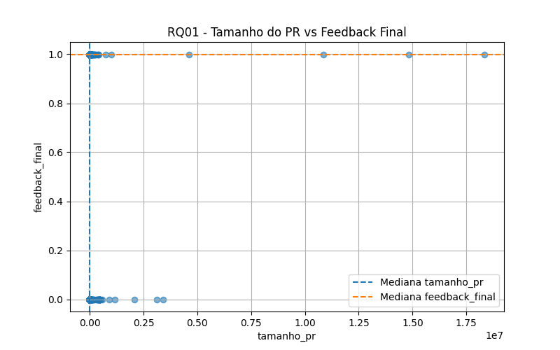
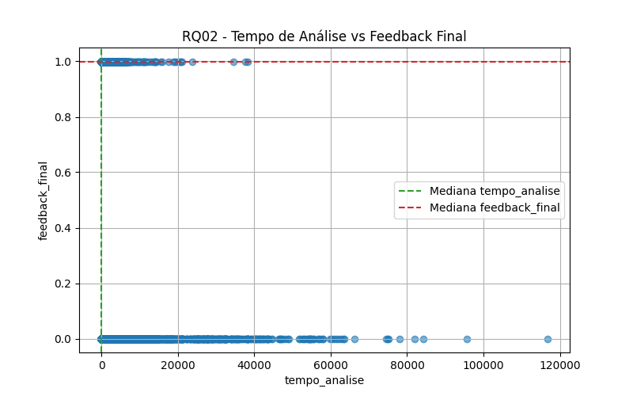
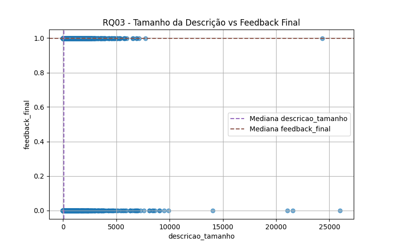
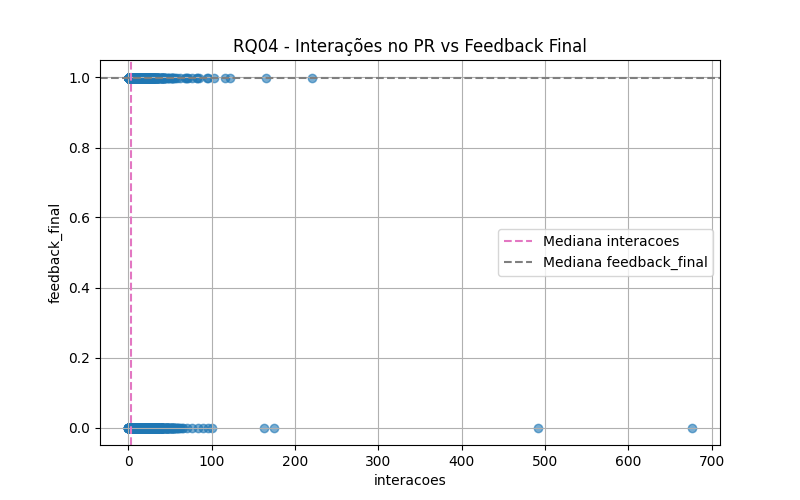
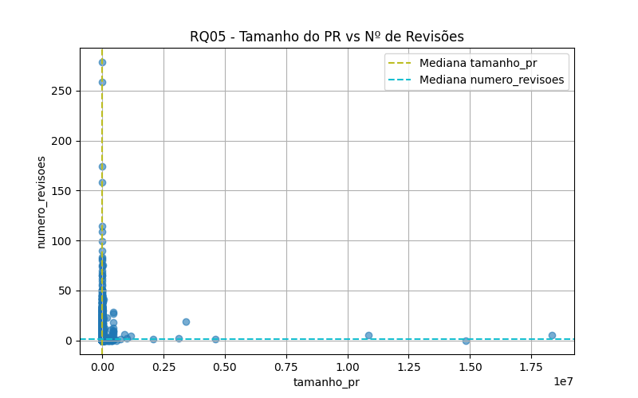
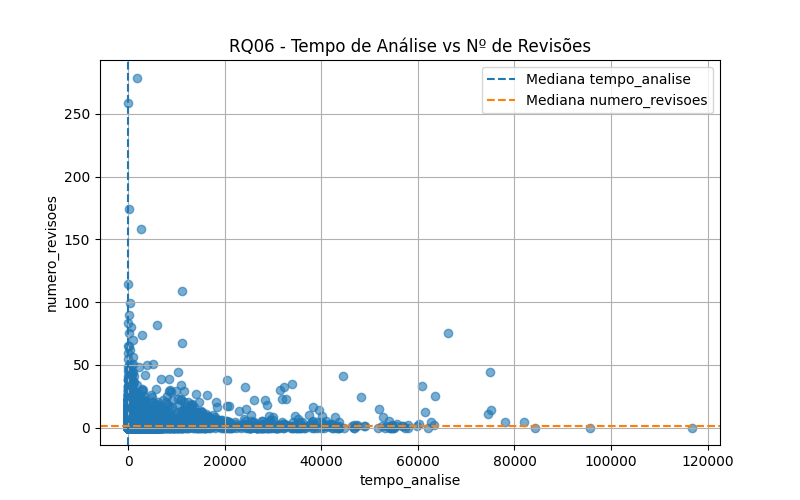
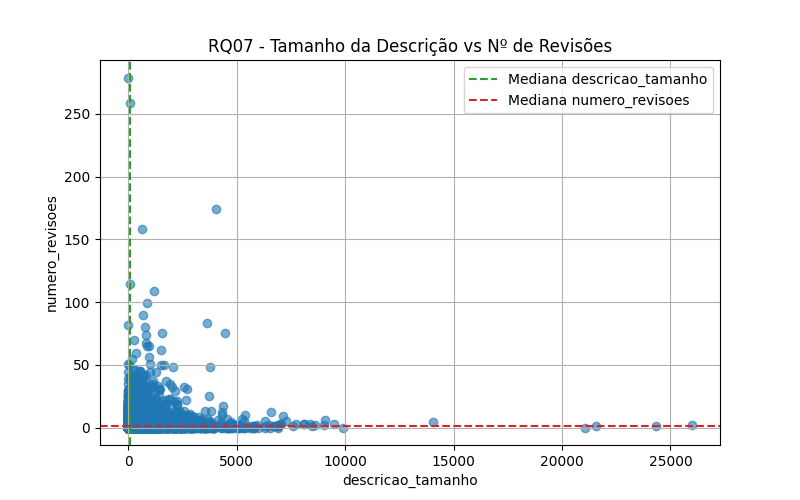
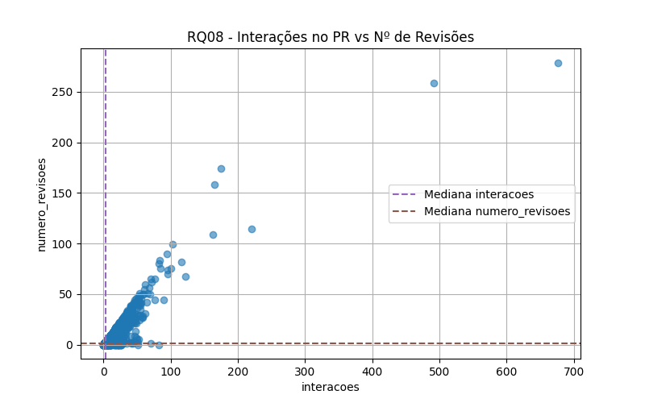

# Relatório Laboratório 3

## Objetivos do Relatório

O objetivo deste laboratório é compreender como diferentes características dos Pull Requests (PRs) influenciam o processo de revisão de
código. Buscamos analisar:

**A. Feedback Final das Revisões**

- **RQ 01**: Relação entre o tamanho dos PRs e o feedback final das revisões
- **RQ 02**: Relação entre o tempo de análise dos PRs e o feedback final das revisões
- **RQ 03**: Relação entre a descrição dos PRs e o feedback final das revisões
- **RQ 04**: Relação entre as interações nos PRs e o feedback final das revisões

**B. Número de Revisões**

- **RQ 05**: Relação entre o tamanho dos PRs e o número de revisões realizadas
- **RQ 06**: Relação entre o tempo de análise dos PRs e o número de revisões realizadas
- **RQ 07**: Relação entre a descrição dos PRs e o número de revisões realizadas
- **RQ 08**: Relação entre as interações nos PRs e o número de revisões realizadas

## Metodologia

A análise foi realizada com base em dados extraídos de PRs de diversos repositórios. Para cada PR, coletamos métricas específicas que foram
utilizadas para responder às questões de pesquisa. O processo foi dividido em duas etapas:

1. **Coleta de Dados**

   Os dados foram coletados utilizando a API GraphQL do GitHub. Foram realizadas consultas para obter informações sobre repositórios e seus
   Pull Requests (PRs), como tamanho, tempo de análise, interações, e descrição. Os resultados foram armazenados em arquivos CSV para
   posterior análise.

2. **Análise dos Dados**

   A análise foi realizada com base em dados extraídos de PRs dos repositórios (ao total, foram extraídos 200 PRs por repositório). Para
   cada PR, coletamos métricas específicas que foram utilizadas para responder às questões de pesquisa em arquivos CSV. A partir dos
   arquivos rodamos um script utilizando a biblioteca pandas para gerar gráficos.

   Para avaliar as relações entre as variáveis, foi utilizado o teste de correlação de Spearman. Esta escolha se justifica pelo fato de que
   as distribuições dos dados nem sempre seguem uma distribuição normal e, portanto, o teste de Spearman — que é não-paramétrico — é mais
   apropriado. Ele mede a força e a direção da associação monotônica entre duas variáveis.

   Além disso, todas as análises foram realizadas com base nos valores medianos dos PRs, conforme proposto, para garantir uma interpretação
   mais robusta e menos sensível a outliers.

## Resultados Obtidos

### **RQ01. Qual a relação entre o tamanho dos PRs e o feedback final das revisões?**

#### **Hipótese**

PRs maiores, com mais arquivos modificados e linhas alteradas, tendem a receber mais feedbacks negativos, por apresentarem maior
complexidade e risco.

#### **Análise Final**

Não foi observada relação forte entre o tamanho dos PRs e o feedback final das revisões. A análise revelou que a maioria dos PRs com
feedbacks negativos apresentaram tamanhos menores. O coeficiente de Spearman (-0.018) indica uma correlação negativa muito pequena entre o
tamanho do PR e o feedback final, sugerindo que o tamanho do PR não é o único fator determinante para o feedback final. Outros aspectos,
como a clareza da proposta ou a experiência do revisor, podem ter um papel mais significativo na avaliação do PR.

| RQ   | Descrição                       | Coeficiente | p-valor | Categoria     |
|------|---------------------------------|-------------|---------|---------------|
| RQ01 | Tamanho do PR vs Feedback Final | -0.018      | 0.01    | Muito pequeno |

### **RQ02. Qual a relação entre o tempo de análise dos PRs e o feedback final das revisões?**

#### **Hipótese**

PRs que demoram mais para serem analisados têm maior chance de receber feedbacks negativos, indicando que revisores encontraram dificuldades
ou incertezas durante a análise.

#### **Análise Final**

PRs que levam mais tempo para serem analisados podem estar associados a dificuldades ou incertezas por parte dos revisores, o que pode
resultar em feedbacks mais negativos. O coeficiente de Spearman (-0.329) indica uma correlação negativa moderada entre o tempo de análise e
o feedback final, corroborando a hipótese de que PRs com feedbacks negativos tendem a ter um tempo de análise mais longo, enquanto PRs com
feedbacks positivos são analisados mais rapidamente.

| RQ   | Descrição                          | Coeficiente | p-valor | Categoria |
|------|------------------------------------|-------------|---------|-----------|
| RQ02 | Tempo de Análise vs Feedback Final | -0.329      | 0.0     | Moderado  |

---

### **RQ03. Qual a relação entre a descrição dos PRs e o feedback final das revisões?**

#### **Hipótese**

PRs com descrições mais detalhadas têm maior chance de serem aceitos, pois fornecem mais contexto e facilitam o trabalho dos revisores.

#### **Análise Final**

O tamanho da descrição não é um fator determinante para o feedback final, apresentando um coeficiente negativo (-0.083). Curiosamente, a
direção negativa sugere que PRs com descrições mais longas tiveram uma leve tendência a receber feedbacks negativos. Isso pode indicar que
descrições excessivamente longas ou complexas geram confusão, ou exigem mais tempo de análise, prejudicando a aceitação. Dessa forma,
hipótese não é suportada. Descrições mais detalhadas não garantem feedbacks positivos, e em alguns casos, podem até prejudicar a aceitação.

| RQ   | Descrição                              | Coeficiente | p-valor | Categoria     |
|------|----------------------------------------|-------------|---------|---------------|
| RQ03 | Tamanho da Descrição vs Feedback Final | -0.083      | 0.0     | Muito pequeno |

---

### **RQ04. Qual a relação entre as interações nos PRs e o feedback final das revisões?**

#### **Hipótese**

PRs com mais interações (comentários e participantes) tendem a receber feedbacks negativos ou pedidos de mudanças, sugerindo que houve mais
debate ou discordância durante a revisão.

#### **Análise Final**

A correlação negativa (-0.224) confirma a hipótese: PRs com mais comentários e participantes estão associados a feedbacks negativos ou
pedidos de mudanças. Isso sugere que discussões prolongadas podem indicar problemas subjacentes, como divergências técnicas ou requisitos
mal definidos.

| RQ   | Descrição                          | Coeficiente | p-valor | Categoria |
|------|------------------------------------|-------------|---------|-----------|
| RQ04 | Interações no PR vs Feedback Final | -0.224      | 0.0     | Pequeno   |

---

### **RQ05. Qual a relação entre o tamanho dos PRs e o número de revisões realizadas?**

#### **Hipótese**

PRs maiores tendem a passar por mais revisões, pois envolvem mais código e, consequentemente, mais pontos a serem discutidos e ajustados.

#### **Análise Final**

A correlação positiva (0.207) indica que PRs maiores estão levemente associados a mais revisões. Isso sugere que, embora PRs grandes
demandem mais atenção, outros fatores (como clareza da implementação ou experiência do autor) podem mitigar a necessidade
de múltiplas revisões. Portanto, a hipótese inicial é parcialmente suportada. O tamanho influencia, mas não é o principal determinante do
número de revisões.

| RQ   | Descrição                       | Coeficiente | p-valor | Categoria |
|------|---------------------------------|-------------|---------|-----------|
| RQ05 | Tamanho do PR vs Nº de Revisões | 0.207       | 0.0     | Pequeno   |

---

### **RQ06. Qual a relação entre o tempo de análise dos PRs e o número de revisões realizadas?**

#### **Hipótese**

PRs com tempo de análise mais longo tendem a ter mais revisões, refletindo um processo de revisão mais cuidadoso ou complexo.

#### **Análise Final**

A correlação positiva (0.247) confirma que PRs com processos de revisão mais longos tendem a ter mais revisões. Isso pode refletir tanto um
processo mais rigoroso quanto dificuldades recorrentes que exigem retrabalho. A hipótese inicial foi corroborada.

| RQ   | Descrição                          | Coeficiente | p-valor | Categoria |
|------|------------------------------------|-------------|---------|-----------|
| RQ06 | Tempo de Análise vs Nº de Revisões | 0.247       | 0.0     | Pequeno   |

---

### **RQ07. Qual a relação entre a descrição dos PRs e o número de revisões realizadas?**

#### **Hipótese**

PRs com descrições mais completas tendem a ter menos revisões, pois os revisores entendem melhor a proposta e encontram menos necessidade de
esclarecimentos ou mudanças.

#### **Análise Final**

A correlação positiva (0.261) contradiz a hipótese. PRs com descrições mais longas estão associados a mais revisões. Uma possível explicação
é que descrições detalhadas podem gerar mais perguntas ou exigir ajustes adicionais, prolongando o processo. Portanto, a hipótese inicial
não foi confirmada.

| RQ   | Descrição                              | Coeficiente | p-valor | Categoria |
|------|----------------------------------------|-------------|---------|-----------|
| RQ07 | Tamanho da Descrição vs Nº de Revisões | 0.261       | 0.0     | Pequeno   |

---

### **RQ08. Qual a relação entre as interações nos PRs e o número de revisões realizadas?**

#### **Hipótese**

PRs com mais interações tendem a ter mais revisões, pois o maior número de participantes e comentários indica um processo de revisão mais
ativo e colaborativo.

#### **Análise Final**

A correlação é extremamente forte (0.934), indicando que interações (comentários e participantes) são o principal fator associado ao número
de revisões. Isso sugere que revisões colaborativas e debates ativos são centrais para um processo de revisão iterativo. Dessa forma, a
hipótese é inicial foi confirmada.

| RQ   | Descrição                          | Coeficiente | p-valor | Categoria |
|------|------------------------------------|-------------|---------|-----------|
| RQ08 | Interações no PR vs Nº de Revisões | 0.934       | 0.0     | Grande    |

---

## **Conclusão**

Os principais resultados obtidos indicam que:

- O tamanho dos PRs não apresentou uma relação significativa com o feedback final, mas mostrou uma leve associação positiva com o número de
  revisões realizadas.
- O tempo de análise dos PRs teve uma correlação moderada com feedbacks negativos e uma correlação positiva com o número de revisões,
  sugerindo que PRs mais demorados tendem a ser mais complexos ou problemáticos.
- A descrição dos PRs, embora esperada como um fator positivo, apresentou correlações negativas ou pequenas, indicando que descrições mais
  longas podem gerar confusão ou prolongar o processo de revisão.
- As interações nos PRs, como comentários e número de participantes, mostrara-se o principal fator associado ao número de revisões, com uma
  correlação extremamente forte, reforçando a importância da colaboração no processo de revisão.

| RQ   | Variáveis Analisadas               | Direção  | Força da Correlação | Suporte à Hipótese |
|------|------------------------------------|----------|---------------------|--------------------|
| RQ01 | Tamanho do PR vs Feedback Final    | Negativa | Muito pequena       | Não                |
| RQ02 | Tempo de Análise vs Feedback Final | Negativa | Moderada            | Sim                |
| RQ03 | Descrição vs Feedback Final        | Negativa | Muito pequena       | Não                |
| RQ04 | Interações vs Feedback Final       | Negativa | Pequena             | Sim                |
| RQ05 | Tamanho do PR vs Nº de Revisões    | Positiva | Pequena             | Parcialmente       |
| RQ06 | Tempo de Análise vs Nº de Revisões | Positiva | Pequena             | Sim                |
| RQ07 | Descrição vs Nº de Revisões        | Positiva | Pequena             | Não                |
| RQ08 | Interações vs Nº de Revisões       | Positiva | Grande              | Sim                |

Correlação de spearman completa:

| RQ   | Descrição                              | Coeficiente | p-valor | Categoria     |
|------|----------------------------------------|-------------|---------|---------------|
| RQ01 | Tamanho do PR vs Feedback Final        | -0.018      | 0.01    | Muito pequeno |
| RQ02 | Tempo de Análise vs Feedback Final     | -0.329      | 0.0     | Moderado      |
| RQ03 | Tamanho da Descrição vs Feedback Final | -0.083      | 0.0     | Muito pequeno |
| RQ04 | Interações no PR vs Feedback Final     | -0.224      | 0.0     | Pequeno       |
| RQ05 | Tamanho do PR vs Nº de Revisões        | 0.207       | 0.0     | Pequeno       |
| RQ06 | Tempo de Análise vs Nº de Revisões     | 0.247       | 0.0     | Pequeno       |
| RQ07 | Tamanho da Descrição vs Nº de Revisões | 0.261       | 0.0     | Pequeno       |
| RQ08 | Interações no PR vs Nº de Revisões     | 0.934       | 0.0     | Grande        |