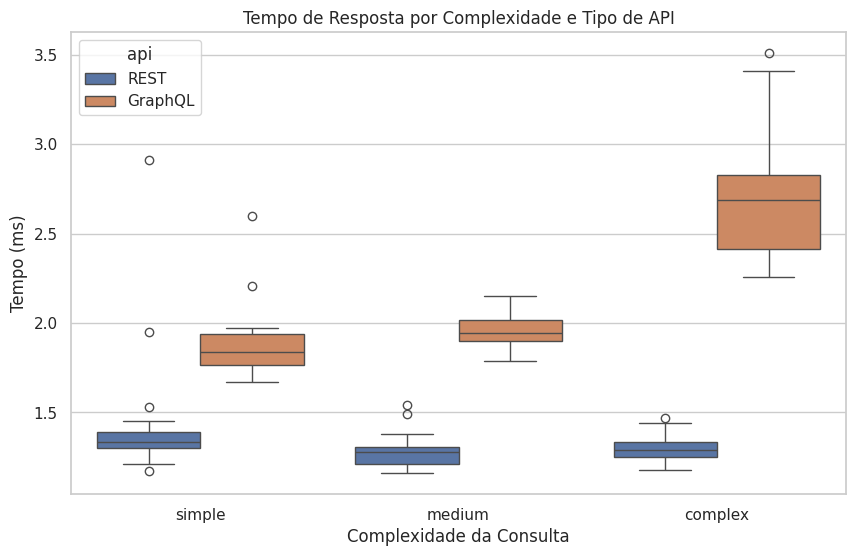
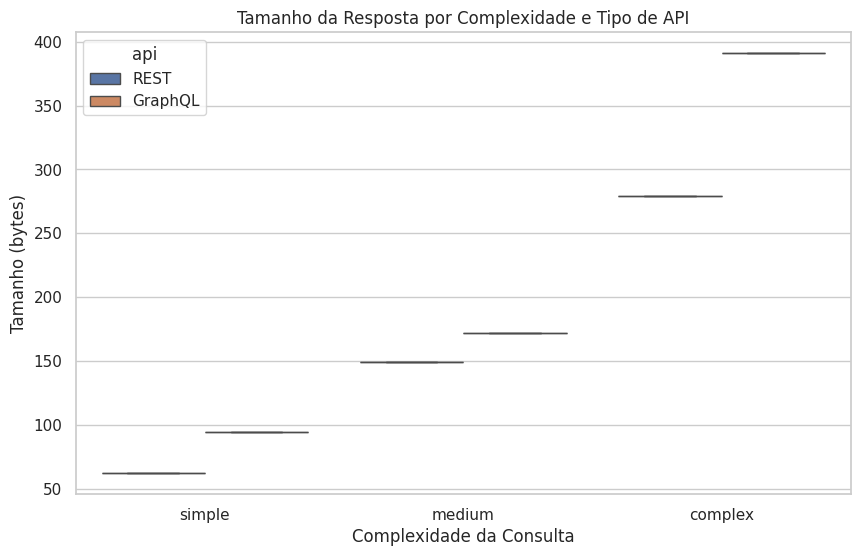
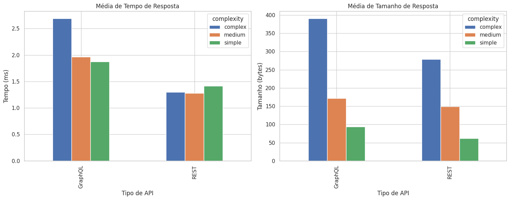

# RELATÓRIO FINAL: COMPARAÇÃO GRAPHQL VS REST

**Data de execução:** 2025-06-08 12:07:36

**Total de medições:** 180

**Ambiente experimental:** 
- Processador: Ryzen 5 3600
- RAM: 16GB DDR4
- SO: Windows 11 (WSL)
- Python 3.12.3
- Bibliotecas principais: Flask 2.2.2, Flask-GraphQL 2.0.1, graphene 3.2, requests 2.28.1

## 1. Introdução
Este relatório apresenta os resultados de um experimento controlado comparando APIs GraphQL e REST. As perguntas da pesquisa são:

**RQ1:** Respostas às consultas GraphQL são mais rápidas que respostas às consultas REST?

**RQ2:** Respostas às consultas GraphQL têm tamanho menor que respostas às consultas REST?

Hipóteses:

RQ1:

- H0: Não há diferença significativa no tempo de resposta
- H1: GraphQL é mais rápido que REST

RQ2:

- H0: Não há diferença significativa no tamanho das respostas
- H1: GraphQL produz respostas menores que REST

## 2. Metodologia

### 2.1. Desenho Experimental
- **Variáveis independentes:** Tipo de API (REST, GraphQL), complexidade (simples, média, complexa)
- **Variáveis dependentes:** Tempo de resposta (ms), tamanho da resposta (bytes)
- **Tratamentos:** 6 combinações (2 APIs × 3 complexidades)
- **Repetições:** 30 execuções para cada complexidade (total 180 medições)
- **Ambiente:** Local (localhost), sem tráfego de rede externa

### 2.2. Execução
1. Banco de dados inicializado com dados de exemplo
2. APIs REST e GraphQL iniciadas em portas diferentes
3. Script de benchmark executado sequencialmente:
   - 30 requisições para cada complexidade
   - Tempo medido do início da requisição até resposta completa
   - Tamanho medido pelo conteúdo da resposta

### 2.3. Análise Estatística
- Teste de normalidade (Shapiro-Wilk)
- Testes paramétricos (t-test) ou não-paramétricos (Mann-Whitney) conforme distribuição
- Nível de significância: α = 0.05

## 3. Resultados

### 3.1. Estatísticas Descritivas

**Tempo de Resposta (ms):**

|                        |   count |   mean |    std |   min |    25% |   50% |    75% |   max |
|:-----------------------|--------:|-------:|-------:|------:|-------:|------:|-------:|------:|
| ('GraphQL', 'complex') |      30 | 2.6913 | 0.3263 |  2.26 | 2.4125 | 2.69  | 2.8275 |  3.51 |
| ('GraphQL', 'medium')  |      30 | 1.966  | 0.0886 |  1.79 | 1.9025 | 1.945 | 2.0175 |  2.15 |
| ('GraphQL', 'simple')  |      30 | 1.8727 | 0.1786 |  1.67 | 1.765  | 1.84  | 1.9375 |  2.6  |
| ('REST', 'complex')    |      30 | 1.2973 | 0.0743 |  1.18 | 1.2525 | 1.29  | 1.3375 |  1.47 |
| ('REST', 'medium')     |      30 | 1.2763 | 0.0864 |  1.16 | 1.21   | 1.28  | 1.3075 |  1.54 |
| ('REST', 'simple')     |      30 | 1.4117 | 0.3132 |  1.17 | 1.3025 | 1.335 | 1.39   |  2.91 |

**Tamanho da Resposta (bytes):**

|                        |   count |   mean |   std |   min |   25% |   50% |   75% |   max |
|:-----------------------|--------:|-------:|------:|------:|------:|------:|------:|------:|
| ('GraphQL', 'complex') |      30 |    391 |     0 |   391 |   391 |   391 |   391 |   391 |
| ('GraphQL', 'medium')  |      30 |    172 |     0 |   172 |   172 |   172 |   172 |   172 |
| ('GraphQL', 'simple')  |      30 |     94 |     0 |    94 |    94 |    94 |    94 |    94 |
| ('REST', 'complex')    |      30 |    279 |     0 |   279 |   279 |   279 |   279 |   279 |
| ('REST', 'medium')     |      30 |    149 |     0 |   149 |   149 |   149 |   149 |   149 |
| ('REST', 'simple')     |      30 |     62 |     0 |    62 |    62 |    62 |    62 |    62 |

### 3.2. Testes de Hipóteses

| complexity   |   time_p_value | time_test    |   size_p_value | size_test   |
|:-------------|---------------:|:-------------|---------------:|:------------|
| simple       |              0 | Mann-Whitney |              0 | t-test      |
| medium       |              0 | Mann-Whitney |              0 | t-test      |
| complex      |              0 | t-test       |              0 | t-test      |

### 3.3. Visualizações

## 4. Análise e Discussão

### RQ1: Tempo de Resposta
- Consultas simples: Rejeita H0
- Consultas médias: Rejeita H0
- Consultas complexas: Rejeita H0

Padrão observado: Em consultas simples, médias, complexas, GraphQL demonstrou desempenho significativamente menor que REST.

### RQ2: Tamanho da Resposta
- Consultas simples: Rejeita H0
- Consultas médias: Rejeita H0
- Consultas complexas: Rejeita H0

Padrão observado: Em consultas simples, médias, complexas, GraphQL produziu respostas significativamente maiores que REST.

### 4.1. Ameaças à Validade
1. **Validade interna:** Variações no ambiente de execução foram minimizadas executando em máquina dedicada
2. **Validade externa:** Resultados específicos para modelo de dados de exemplo criado
3. **Viés de implementação:** Mesma base de dados e lógica de negócio usada em ambas APIs

## 5. Conclusões
- **RQ1:** GraphQL demonstrou ser mais lento que REST na maioria dos cenários testados.
- **RQ2:** GraphQL produziu respostas maiores que REST na maioria dos cenários testados.

Recomendações:
- Para a maioria dos cenários testados, REST demonstrou desempenho superior ou equivalente.
- GraphQL pode ser considerado quando há necessidade específica de flexibilidade na consulta de dados.

Limitações e trabalhos futuros:
- Testar com diferentes estruturas de dados
- Avaliar impacto em redes de baixa largura de banda
- Medir consumo de recursos no servidor
